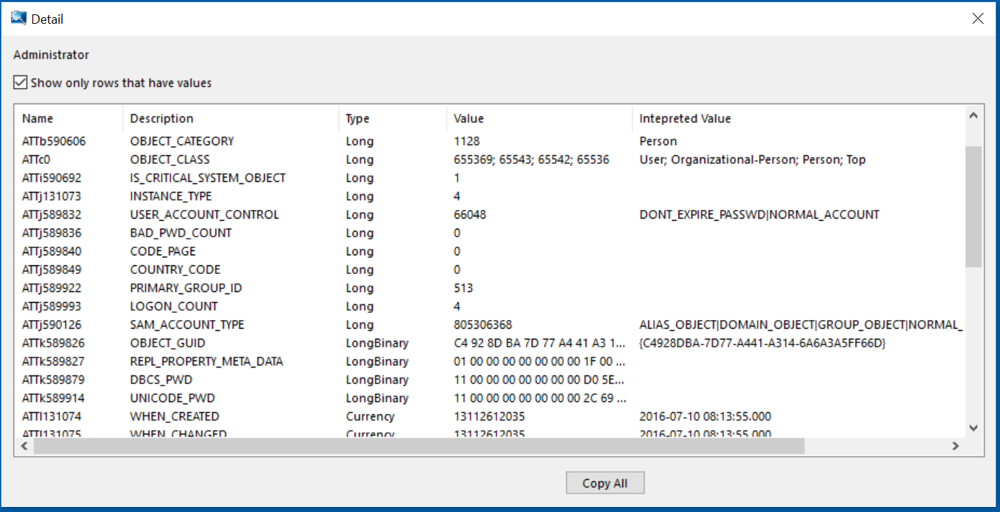

# DIT Snapshot Viewer
DIT Snapshot Viewer is an inspection tool for Active Directory database, ntds.dit. This tool connects to ESE(Extensible Storage Engine) and reads tables/records including hidden objects by [low level C API](https://msdn.microsoft.com/en-us/library/gg269259%28v=exchg.10%29.aspx).

The tool can extract ntds.dit file without stopping lsass.exe. When Active Directory Service is running, lsass.exe locks the file and does not allow to access to it. The snapshot wizard copies ntds.dit using VSS(Volume Shadow Copy Service) even if the file is exclusively locked. As copying ntds.dit may cause data inconsistency in ESE DB, the wizard automatically runs __esentutil /repair__ command to fix the inconsistency.

EseDataAccess static library can be used for other ESE inspection applications. It has C++ object-oriented representation of ESE C API. For example, ESE table is represented by EseTable class defined as below.
```C++
class EseTable
{
	public:
		EseTable(const EseDatabase* const eseDatabase, string tableName);
		~EseTable();
		void MoveFirstRecord() const;
		bool MoveNextRecord() const;
		void Move(uint rowIndex) const;
		int CountColumnValue(uint columnIndex) const;
		wstring RetrieveColumnDataAsString(uint columnIndex, uint itagSequence = 1);
		uint GetColumnCount() const;
		wstring GetColumnName(uint columnIndex) const;
}
```
The executable is available here.
[Download ditsnap.exe](https://github.com/yosqueoy/ditsnap/releases)
## Screenshots
### Main Window

### Detail Dialog

## Interpreted Value
Interpreted Value column in Detail Dialog shows human-readable representaions of raw ESE column values. Here are the exmamples.
#### OBJECT_CATEGORY
The attribute is stored as a 32-bit integer in ESE, which points to DNT (Distinguished Name Tag) of another Active Directory object. Interpreted Value for the attribute shows RDN (Relative Distinguished Name) of the object.
#### OBJECT_CLASS
The attribute is stored as a multi-valued 32-bit integer column in ESE, which points to [GOVERNS_ID](https://msdn.microsoft.com/en-us/library/cc219949.aspx) of other objects. Interpreted Value for the attribute shows RDNs of the objects.
#### PWD_LAST_SET, LAST_LOGON, LAST_LOGOFF, ACCOUNT_EXPIRES
Those attributes are stored as 64-bit integers in ESE, which are treated as [FILETIME](https://msdn.microsoft.com/en-us/library/windows/desktop/ms724284(v=vs.85).aspx) in Active Directory. Interpreted Value column for the attributes shows it as a date format.
#### WHEN_CREATED, WHEN_CHANGED
  Those attributes are stored as 64-bit integers in ESE, which are treated as shortened [FILETIME](https://msdn.microsoft.com/en-us/library/windows/desktop/ms724284(v=vs.85).aspx) (1/10000000 of the integer representation of [FILETIME](https://msdn.microsoft.com/en-us/library/windows/desktop/ms724284(v=vs.85).aspx)). Interpreted Value for those attributes shows it as a date format.
#### USER_ACCOUNT_CONTROL
  The attribute is stored as a 32-bit integer in ESE, which are treated as flags that control the behavior of the user account. Interpreted Value for the attribute shows the list of flags.
See https://msdn.microsoft.com/en-us/library/ms680832(v=vs.85).aspx.
